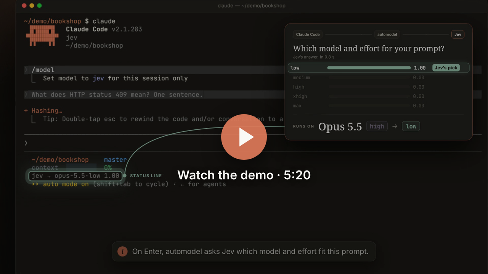

# automodel

A small tool for Claude Code: pick **Jev (auto)** in `/model`, and it picks
the model and effort for each prompt, subagent and workflow step. A quick
question gets low effort, a race condition extra-high, a file listing Haiku.
Decisions come from [TypeSafe Jev](https://docs.typesafe.ai) on OpenRouter
(under a second, ~$0.00004 each); your Claude traffic stays on your own
subscription.

<p align="center"><a href="https://youtu.be/nj46rynF0zY"></a><br><sub>Demo: <a href="https://youtu.be/nj46rynF0zY">watch on YouTube (5 min)</a></sub></p>

## Install

```sh
curl -fsSL https://raw.githubusercontent.com/moukrea/automodel/main/install.sh | sh
```

Linux or macOS (Windows: [below](#windows)). The script installs the binary in
`~/.local/bin`, starts the local proxy, wires Claude Code (your
`settings.json` is backed up first) and asks for your OpenRouter key. Then
open `/model` in Claude Code and pick **Jev (auto)**. `automodel doctor`
checks the whole setup, one line per check with the fix for each problem.

The proxy runs as a systemd user service, or a launchd agent on macOS.
Without a systemd user session (containers, WSL1, minimal distros) it runs as
a background process that is not restarted after a reboot: `install` prints
the line to add to `~/.profile` (`automodel start` does nothing when the
proxy already runs).

- Updates: the service installs new releases by itself (checked daily,
  applied when idle). `automodel update` does it now; `[update] auto = false`
  in the config turns it off.
- Uninstall: `automodel uninstall` (config and state are kept).
- From source: `go build -o ~/.local/bin/automodel ./cmd/automodel && automodel install`.

### Windows

In PowerShell (no admin rights needed):

```powershell
irm https://raw.githubusercontent.com/moukrea/automodel/main/install.ps1 | iex
```

The binary goes to `%LOCALAPPDATA%\automodel\bin` (added to your user
PATH). The proxy runs as a background process and starts at each logon
through `HKCU\Software\Microsoft\Windows\CurrentVersion\Run` (a console
window flashes briefly at logon). Claude Code reads
`%USERPROFILE%\.claude\settings.json` and runs the hook and statusline
commands with Git Bash, or PowerShell without Git for Windows: automodel
writes them for both. Config and state live under `%USERPROFILE%\.config`
and `%USERPROFILE%\.local\state`, as on Linux. Self-updates work the same;
the replaced binary is kept as `automodel.exe.old` until the proxy restarts.

## How it works

One Go binary does everything: the proxy, the hooks, the statusline, the
report and the catalog checks.

```
UserPromptSubmit ─▶ automodel hook decide ─▶ Jev ─▶ state/sessions/<id>.json ─┐
PreToolUse[Agent] ─▶ automodel hook agent  ─▶ Jev ─▶ model alias + pending effort┤
PreToolUse[Workflow] ─▶ automodel hook workflow ─▶ {model, effort} per agent()  │
PreCompact / SessionStart / PostModelSwitch ─▶ markers                          │
Claude Code ─(model "jev")─▶ automodel serve ─(model + effort rewritten)─▶ api.anthropic.com
statusLine ─▶ automodel statusline:  jev → opus-5.5·xhigh +ultracode 0.82  ↻ switched
```

`install` does everything and is idempotent:

- writes `~/.config/automodel/config.toml` (0600) and the catalog shipped in
  the binary next to it (updated with new releases unless you edit it),
  keeping your existing
  statusline as `statusline_command` (rendered before the automodel segment;
  it runs detached behind a cache, so a slow script never delays the
  segment: Claude Code cancels a statusline run whenever the next update
  arrives);
- installs and starts the service (systemd user unit `automodel.service`, a
  launchd agent on macOS, or else a background process with a pidfile and
  `proxy.log` in the state dir), then checks
  the proxy is listening **before** touching settings. **If the proxy is down,
  Claude Code no longer works** while `ANTHROPIC_BASE_URL` points at it;
- backs up `~/.claude/settings.json` (`settings.json.automodel-backup-*`) and
  merges the `env` vars, the hooks, the statusline and
  `permissions.allow: ["Workflow"]`.
- adds two user slash commands, `~/.claude/commands/why.md` and `flag.md`:
  `/why` shows the current session's latest decisions, `/flag xhigh too hard
  for low` flags the last one (a file of that name you wrote yourself is
  kept).

The key lives in the config file (read on every hook call, no restart
needed); `automodel key set` reads it on stdin:

```toml
openrouter_api_key = "sk-or-..."
```

`$OPENROUTER_API_KEY` overrides it if set. Without a key, every decision falls
back to the default tier, and the statusline says why
(`⚠ fallback ⚠ jev: no OpenRouter key`; also shown for a rejected key,
missing credits, rate limits and timeouts).

If the proxy stops, the `SessionStart` and `UserPromptSubmit` hooks restart it
once; if it still doesn't answer, the prompt is blocked with a message saying
how to fix it, instead of a connection error on every request.

Only sessions on `jev` are routed: the hooks, the statusline segment and the
proxy leave sessions on a named model (`opus`, `opus[1m]`, …) untouched. The
installer also sets `_CLAUDE_CODE_ASSUME_FIRST_PARTY_BASE_URL=1`, since the
proxy forwards to api.anthropic.com unchanged. Otherwise the custom
`ANTHROPIC_BASE_URL` makes Claude Code treat every session as a gateway
session, and Opus drops from 1M to a 200K window.
Routed `jev` sessions get the full window too (Opus 5.5 has a native 1M
window; the proxy only sends the long-context beta to models that need it),
and main tiers must offer at least
`meta.main_min_context` (1M).

`automodel install --dry-run` only prints what would be merged.
`automodel uninstall` removes the settings entries and the slash commands,
restores your statusline and removes the service (config and state are kept).

## When it decides (main session)

| Trigger | Condition | Cost of switching |
|---|---|---|
| `initial` | first prompt of the session (including after `/clear`) | none |
| `compact` | after a compaction, using the summary | none (the cache is rebuilt anyway) |
| `cold` | inactive for longer than `cache_ttl`, or resumed with an expired cache | none for a top-level change |
| `warm` | any other prompt (`features.warm_decisions`) | see below |

**Warm turns.** Changing the model rebuilds the whole prompt cache, and so
does changing the top-level effort. Models with `per_turn_effort` (Opus 5.5)
accept an effort-only system message mid-conversation: the proxy keeps the
top-level effort fixed for the whole conversation and inserts those messages
at the same places on every request, so an effort change keeps the cache
(measured: 41k tokens read, 51 written, instead of 13k rewritten). A warm
switch must:

1. **pay back**: with `features.cost_aware`, the expected cost of the work at
   each tier (catalog cost per task; working *below* the right tier costs
   `underprovision_penalty` × the gap, working above it costs the gap once)
   plus the switch cost (0 for a per-turn effort change, else the context
   written to the cache again) picks the tier. When no answer could pay back a
   switch, Jev is not even asked;
2. **be confident**: Jev's confidence ≥ `features.warm_min_confidence`;
3. **not downgrade work in progress**: when Jev says the prompt continues the
   ongoing work ("yes, do it", "continue"), effort can go up, never down.

**What Jev is asked** (one call): a *Score* over the scope's tiers (they are
ordered, and a Score sharpens the distribution: mean confidence 0.92 vs 0.88
for a Choice on `testdata/eval`), a yes/no *Noul* per mode, and on warm turns
a Noul on whether the prompt continues the work in progress. The state
carries the prompt, the compaction summary, recent prompts, the last
assistant reply, the tier in force and the session size (context, peak,
compactions).

With `features.cost_aware` off, the v1 confidence rule applies: `≥ θ_act` →
Jev's choice; below it → the higher of the top two; `< θ_low` → one more rank
up. Per-repo floor and ceiling via `.automodel.toml`: `min_tier`, `max_tier`,
`min_subagent_tier`, `max_subagent_tier`. All `[features]` off gives the v1
router.

**Ultracode** is a *mode*, not a model: parallel multi-agent orchestration
layered on the chosen tier, whatever its model, with effort raised to
`xhigh`. Jev answers it as a separate yes/no question (threshold 0.75, from
the eval); the hook injects the standing opt-in to workflow orchestration
(repeated after each compaction, with an "off" notice when it ends).

**Subagents**: the Agent tool only accepts an alias (`opus`, `haiku`…) and has
no effort field. The hook sets the alias, and the proxy binds the effort to
the subagent (`X-Claude-Code-Agent-Id`) on its first request. **Workflows**:
each `agent()` call site that sets no `model`/`effort` gets its own tier,
injected as `{model, effort, ...(opts)}`, so the script's explicit options
still win.

## Your choice wins

- **`/effort`** in Claude Code pins that effort for the session: routing
  pauses (statusline `(pinned)`) until you set `/effort` back to its default.
- **`[effort:xhigh]`** (or `low`, `medium`, `high`, `max`) anywhere in a
  prompt pins it the same way; **`[effort:auto]`** hands control back to Jev.
- **`[model:sonnet]`** (any catalog model by alias, with a 1M window) pins
  the model too, at the effort of `[effort:X]` or the current one;
  `[model:auto]` releases it. Switching model rewrites the prompt cache.
  (`/model opus` in Claude Code leaves automodel out of the session
  entirely.)
- **"think harder"**, "ultrathink", "take your time", "réfléchis bien"…:
  at least one tier above the current one for that prompt.
- A bare **go-ahead** ("yes", "continue", "vas-y", "lgtm") keeps the current
  tier without asking Jev (`features.fast_path`).
- A turn you **interrupted** (Esc) is passed to Jev as a signal.

Per repository, `.automodel.toml` at the repo root:

```toml
min_tier = "high"               # floor / ceiling for the main session
max_tier = "xhigh"
min_subagent_tier = "opus-low"  # same for subagents
disable_modes = ["ultracode"]
privacy = "metadata"            # a repo can make privacy stricter, never looser
```

## Spending cap

```toml
[budget]
usd_per_day = 20               # 0 = off (the default)
usd_per_session = 0            # optional, per session
max_tier_when_over = "medium"  # the highest tier once a cap is reached
max_subagent_tier_when_over = "opus-medium"
```

The proxy prices every response with the catalog and keeps the day's total
(`state_dir/spend.json`, local day) and each session's. Once a cap is
reached, routing picks nothing above `max_tier_when_over` until the next
day (or session); the status line shows `⚠ budget`, and `why` and `report`
show the cap and the decisions it lowered. Your pins are not capped: it's
your call.

## What leaves your machine

- **Claude traffic** goes to api.anthropic.com through the local proxy,
  unchanged except for the model, the effort, `max_tokens` and effort-only
  system messages.
- **Each decision** sends a small routing state to Jev on OpenRouter
  (~$0.00004 per call): the prompt (truncated), your last few prompts, the
  start of the last reply, the compaction summary after a `/compact`, the
  session size, and repo signals (languages, file count, diff stat, the
  start of `CLAUDE.md`).
- With **`privacy = "metadata"`** (in the config, or per repo) no text is
  sent: only sizes and task-kind hints (bug, concurrency, security, review…),
  the phase, the tier in force and the repo languages. Decisions get less
  precise.
- Otherwise only the update check (GitHub releases API, daily unless
  `[update] auto = false`), and `automodel doctor`'s key check against
  OpenRouter. No telemetry: the ledger (`~/.local/state/automodel/`) stays
  local.

## Catalog

`catalog.toml` holds models, prices, measurements, tiers and Jev criteria
(no model ID in the code). It is hot-reloaded. An invalid catalog is rejected
and the last valid one is kept. Updates go through the
`refresh-model-catalog` skill (`.claude/skills/`), which proposes, justifies
(`scripts/frontier.py`) and applies only with your approval, logging each
change in `catalog-history.md`.

```sh
automodel catalog check [--json]                       # validation (non-zero exit on error, for CI)
.claude/skills/refresh-model-catalog/scripts/frontier.py catalog.toml [--json]
```

## Measurement

```sh
automodel why [--session id] [-n 5] [--scope main] [--follow]  # what Jev answered for the last decisions, and why
automodel report [--since 7d] [--json] [--baseline xhigh]
automodel eval [--catalog path] [--format score|choice]    # Jev on labeled cases: accuracy, confidence, calibration
automodel flag [--session id] [--n 1] --want xhigh [--note "..."]  # that pick was wrong
```

`flag` turns a decision (default: the session's latest main decision) into
a labeled case in `~/.local/state/automodel/flagged.jsonl`, with the routing
state that was sent to Jev, the tier you wanted and Jev's probabilities;
`automodel eval --cases ~/.local/state/automodel/flagged.jsonl` replays
them. The states are kept locally per decision (`state_dir/states`, bounded
to 2 MB per session, metadata only under `privacy = "metadata"`);
`record_states = false` turns this off.

`why` shows each decision like the demo's popup: every level with its
probability, the pick, the previous tier, and the reasons (continuation,
switch cost and expected gain, pin, go-ahead, your signals, Jev failures).
`report` lists **suggestions** drawn from your habits, each with its
evidence, only after 5 events or more: a repo where you often pin an effort
above Jev's pick (or ask to think harder, or interrupt turns picked below
`high`) gets a `min_tier` for its `.automodel.toml`; several flagged cases
wanting the same tier suggest reviewing its catalog criteria. It ends
with a conservative estimate of the savings against running everything
at `--baseline`: only the output (response and thinking) is
scaled by the catalog's cost ratios; input and cache reads count as they
were.

Tier mix, modes, warm turns (evaluated, switched, kept and why, skipped),
fallback rate, confidence, cache hit rate for routed vs unrouted
sessions, Jev cost, tokens per tier, and shadow-mode agreement (when
`jev_shadow_model` is set). Raw data: `~/.local/state/automodel/ledger.jsonl`;
hook logs: `hooks.log` next to it.

## Known limits

- Claude Code's spinner shows **its own** effort setting ("thinking with
  xhigh effort"), not the routed one. The statusline is the source of truth.
- With any custom `ANTHROPIC_BASE_URL` (a proxy), Claude Code turns off its
  server-side message threads, which it only uses when talking to
  api.anthropic.com directly. The first prompts of a session reuse a bit less
  of the prompt cache; over real routed sessions the cache still served
  98% of the input tokens.
- A pin (`/effort`, `[effort:X]`) applies to the session's current model.
  Claude Code tells the proxy about `/effort` only with the next request,
  so the first prompt after it is still routed; the pin applies from that
  prompt's first request.

## Tests

```sh
go test ./...
```

The tests cover validation (with a Go ↔ `frontier.py` cross-check), the
policy, the hooks (fake Jev), the proxy (fake upstream: rewrite, SSE,
subagent binding, count_tokens, Haiku stripping), the report, the statusline
and the transcript reader. Spike results are in `docs/spikes.md`.
