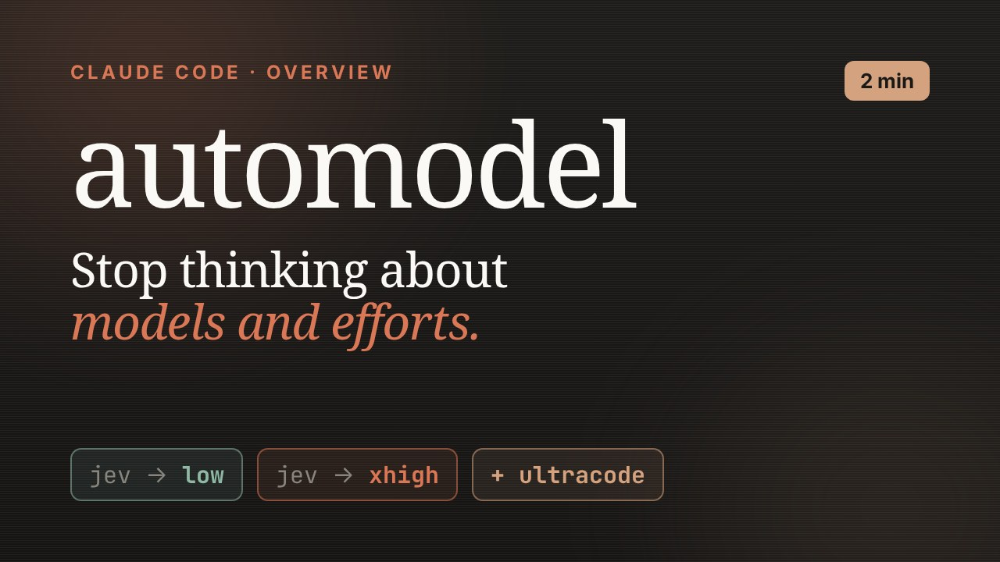
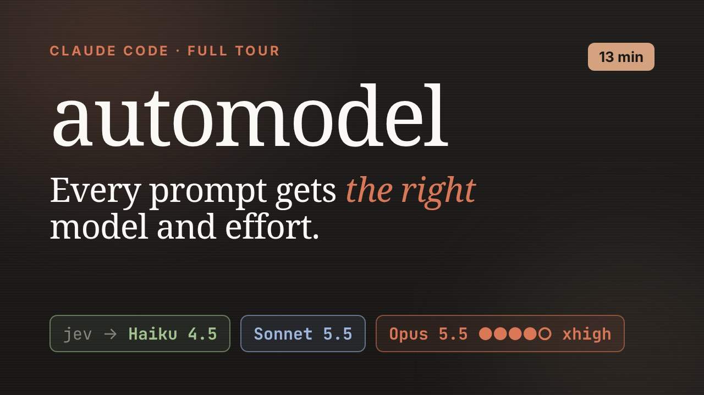

<h1 align="center">
  <picture>
    <source media="(prefers-color-scheme: dark)" srcset="docs/media/wordmark-dark.png">
    
  </picture>
</h1>

A small tool for Claude Code: pick **Jev (auto)** in `/model`, and it picks
the model and effort for each prompt, subagent and workflow step. A quick
question gets Haiku or low effort, a race condition extra-high; subagents get
their own pick (Haiku for a file listing, Sonnet 5.5 for a summary).
Decisions come from [TypeSafe Jev](https://docs.typesafe.ai) on OpenRouter
(under a second, ~$0.00004 each); your Claude traffic stays on your own
subscription.

<p align="center">
  <a href="https://youtu.be/XOAAOmwHQSw" title="automodel overview (2 min, YouTube)"></a>
  <a href="https://youtu.be/KeMISZr58YE" title="automodel full tour (13 min, YouTube)"></a>
  <br><sub><a href="https://youtu.be/XOAAOmwHQSw">Overview (2 min)</a> · <a href="https://youtu.be/KeMISZr58YE">Full tour (13 min)</a> · <a href="https://moukrea.github.io/automodel/">Documentation site</a></sub>
</p>

## Install

```sh
curl -fsSL https://raw.githubusercontent.com/moukrea/automodel/main/install.sh | sh
```

Linux or macOS (Windows: [below](#windows)). The script installs the binary in
`~/.local/bin`, starts the local proxy, wires Claude Code (your
`settings.json` is backed up first) and asks for your OpenRouter key. Then
open `/model` in Claude Code and pick **Jev (auto)**. `automodel doctor`
checks the whole setup, one line per check with the fix for each problem.

The proxy runs as a systemd user service, or a launchd agent on macOS.
Without a systemd user session (containers, WSL1, minimal distros) it runs as
a background process that is not restarted after a reboot: `install` prints
the line to add to `~/.profile` (`automodel start` does nothing when the
proxy already runs).

- Updates: the service installs new releases by itself (checked every 6 hours,
  applied when idle). `automodel update` does it now; `[update] auto = false`
  in the config turns it off.
- Uninstall: `automodel uninstall` (config and state are kept).
- From source: `go build -o ~/.local/bin/automodel ./cmd/automodel && automodel install`.

### Windows

In PowerShell (no admin rights needed):

```powershell
irm https://raw.githubusercontent.com/moukrea/automodel/main/install.ps1 | iex
```

The binary goes to `%LOCALAPPDATA%\automodel\bin` (added to your user
PATH). The proxy runs as a background process and starts at each logon
through `HKCU\Software\Microsoft\Windows\CurrentVersion\Run` (a console
window flashes briefly at logon). Claude Code reads
`%USERPROFILE%\.claude\settings.json` and runs the hook and statusline
commands with Git Bash, or PowerShell without Git for Windows: automodel
writes them for both. Config and state live under `%USERPROFILE%\.config`
and `%USERPROFILE%\.local\state`, as on Linux. Self-updates work the same;
the replaced binary is kept as `automodel.exe.old` until the proxy restarts.

## How it works

One Go binary does everything: the proxy, the hooks, the statusline, the
report and the catalog checks.

```
UserPromptSubmit ─▶ automodel hook decide ─▶ Jev ─▶ state/sessions/<id>.json ─┐
PreToolUse[Agent] ─▶ automodel hook agent  ─▶ Jev ─▶ model alias + pending effort┤
PreToolUse[Workflow] ─▶ automodel hook workflow ─▶ {model, effort} per agent()  │
PreCompact / SessionStart / PostModelSwitch ─▶ markers                          │
Claude Code ─(model "jev")─▶ automodel serve ─(model + effort rewritten)─▶ api.anthropic.com
statusLine ─▶ automodel statusline:  jev → opus-5.5·xhigh +ultracode 0.82  ↻ switched
```

`install` does everything and is idempotent:

- writes `~/.config/automodel/config.toml` (0600) and the catalog shipped in
  the binary next to it (updated with new releases unless you edit it),
  keeping your existing
  statusline as `statusline_command` (rendered before the automodel segment;
  it runs detached behind a cache, so a slow script never delays the
  segment: Claude Code cancels a statusline run whenever the next update
  arrives), except [agentline](#status-line), which shows the segment
  itself and is left in place;
- installs and starts the service (systemd user unit `automodel.service`, a
  launchd agent on macOS, or else a background process with a pidfile and
  `proxy.log` in the state dir), then checks
  the proxy is listening **before** touching settings. **If the proxy is down,
  Claude Code no longer works** while `ANTHROPIC_BASE_URL` points at it;
- backs up `~/.claude/settings.json` (`settings.json.automodel-backup-*`) and
  merges the `env` vars, the hooks, the statusline and
  `permissions.allow: ["Workflow"]`.
- adds two user slash commands, `~/.claude/commands/why.md` and `flag.md`:
  `/why` shows the current session's latest decisions, `/flag xhigh too hard
  for low` flags the last one (a file of that name you wrote yourself is
  kept).

The key lives in the config file (read on every hook call, no restart
needed); `automodel key set` reads it on stdin:

```toml
openrouter_api_key = "sk-or-..."
```

`$OPENROUTER_API_KEY` overrides it if set. Without a key, every decision falls
back to the default tier, and the statusline says why
(`⚠ fallback ⚠ jev: no OpenRouter key`; also shown for a rejected key,
missing credits, rate limits and timeouts).

If the proxy stops, the `SessionStart` and `UserPromptSubmit` hooks restart it
once; if it still doesn't answer, the prompt is blocked with a message saying
how to fix it, instead of a connection error on every request.

Only sessions on `jev` are routed: the hooks, the statusline segment and the
proxy leave sessions on a named model (`opus`, `opus[1m]`, …) untouched. The
installer also sets `_CLAUDE_CODE_ASSUME_FIRST_PARTY_BASE_URL=1`, since the
proxy forwards to api.anthropic.com unchanged. Otherwise the custom
`ANTHROPIC_BASE_URL` makes Claude Code treat every session as a gateway
session, and Opus drops from 1M to a 200K window.
Routed `jev` sessions get the full window too (Opus 5.5 has a native 1M
window; the proxy only sends the long-context beta to models that need it),
and main tiers must offer at least
`meta.main_min_context` (1M).

`automodel install --dry-run` only prints what would be merged.
`automodel uninstall` removes the settings entries and the slash commands,
restores your statusline (agentline's is left as is) and removes the service
(config and state are kept).

## Status line

On a `jev` session the automodel segment shows what the routing chose:
`jev → opus-5.5·xhigh +ultracode 0.86` (model, effort, mode, Jev's
confidence), `(default)` before the first decision, `(pinned)` while your
`/effort` wins, `· real effort: low (Claude Code shows xhigh)` when Claude
Code's own spinner shows another effort than the one routed, `⚠ fallback` and
`⚠ jev: <why>` when Jev couldn't be asked, `⚠ budget` over the spending cap,
and `↻ switched|compact|cold` for `statusline_flash` (30s) after a
redecision. Sessions on a named model show nothing.

**Your own status line** is kept: `install` saves it as `statusline_command`
in `config.toml` and prints it above the segment (it runs detached behind a
cache and sees `AUTOMODEL_CHAINED=1` in its environment). Set or change
`statusline_command` there to chain another one.

**[agentline](https://github.com/moukrea/agentline)** renders the routing
natively instead: the routed model and effort in place of Claude Code's
`Jev (auto)`, then the confidence and flags in its own `route` segment, fitted
to the terminal width. A status line whose command contains `agentline` is
left in place by `install`, the self-update and `uninstall` (never
chained), and `doctor` reports `agentline shows the automodel segment`. The same goes for a wrapper script that runs the automodel status line
itself (jaunt's rich view does this): it is kept as is, never replaced or
chained.

**Other status line authors**: `automodel [--config path] statusline --json`
reads Claude Code's status line JSON on stdin, records model switches like
the text status line, never runs `statusline_command`, and prints one line.
Tools that only read the state (session viewers, dashboards) add
`--read-only`: nothing is written, not even a state file for a session
automodel hasn't seen.

```json
{"v":1,"routed":true,"alias":"jev","model":"claude-opus-5-5","label":"Opus 5.5","effort":"xhigh","mode":"ultracode","state":"routed","confidence":0.86,"pin":"","issue":"","flash":"","budget":"","claude_effort":"","text":"jev → opus-5.5·xhigh +ultracode 0.86"}
```

`{"v":1,"routed":false}` for a session automodel doesn't route (with every
field and `state` `error` when the catalog can't load: read `routed` first).
`state` is `routed|default|fallback|pinned|error` (`error`: the catalog can't
load, `issue` says `catalog`); `confidence` is 0 unless `routed`; `pin` is the
pinned effort; `issue` why Jev couldn't be asked; `flash`
`switched|compact|cold|""`; `budget` `over` past the spending cap, else
`""`; `claude_effort` the effort Claude Code itself shows when it differs from
`effort` (its spinner shows its own setting, not the routed one), else `""`;
`text` the text segment. Find the command in
`settings.json` (the `UserPromptSubmit` hook ending in ` hook decide`, minus
that suffix) and check `automodel help` mentions `statusline … --json`
before calling it: older releases would render (and chain) the text status
line instead. Skip the call when `AUTOMODEL_CHAINED=1`.

## When it decides (main session)

| Trigger | Condition | Cost of switching |
|---|---|---|
| `initial` | first prompt of the session (including after `/clear`) | none |
| `compact` | after a compaction, using the summary | none (the cache is rebuilt anyway) |
| `cold` | inactive for longer than `cache_ttl`, or resumed with an expired cache | none for a top-level change |
| `warm` | any other prompt (`features.warm_decisions`) | see below |

**The work in progress.** A session keeps its work in progress: the tier
and mode it was decided at, the model it runs on when you asked for one in
words, and the prompt that started it. The first prompt sets it, and so
does a prompt that starts separate work or an effort, a mode or a model you
ask for in words. Jev's level question rates the new prompt's
own words, but the effort runs the whole turn, which carries the pending
work on: "also add a test for that" after a race fix reads as medium work.
So every later prompt also gets Jev's answer on how it relates to that work
(one *Choice*):

| relation | for example | tier |
|---|---|---|
| `continue` | "yes", "vas-y", "resume, the limits are reset" | at least the work's |
| `extend` | "also add a test for that", "mais garde l'ancienne API" | at least the work's |
| `inform` | "FYI it only fails on ARM", "env vars win", "the staging cluster only has 4 GPUs free until noon" (the work's facts, environment, resources, schedule or people) | at least the work's |
| `side_question` | "is CI green yet?", "t'en es où ?", "would Fable do better on this bug?" (about the work itself) | at least the work's, without its mode; the work stays |
| `aside` | "what does HTTP 409 mean again?", "why did the effort go up?", "merci !" (unrelated to the work, about automodel's routing, or an acknowledgement) | its own, for that turn; the work stays |
| `resume` | "back to the migration", "reprends le refacto" (only offered when a detour paused some work) | the paused work's; it becomes the work again |
| `wrap_up` | "write the commit message", "push it", a recap of finished work, "yes" to "Want me to open the PR?" once it is done | its own, without the work's mode; the work is marked done |
| `new_task` | "now rename the config loader", the same change on another page | its own; it becomes the work |

A prompt gets its own level, lower if that is its level, only when Jev puts
at least `meta.relation_separate_threshold` (0.55) on `wrap_up`,
`new_task` and `aside` together (on the eval's train split, 0.45 to 0.55
give the same decisions and no follow-up below its work). Any other prompt
keeps at least the work's tier and mode, and raises the work when it needs
more. A wrap-up, a side question or an aside runs without the work's
ultracode mode, which the work keeps for the next follow-up, and changes
nothing of the work: what it asks for or needs (an effort, a model,
"ultrathink", a level above the work) is for that answer only. Once a
wrap-up has marked the work done, only more work on it (a go-ahead, an
addition) reopens it and holds its level; a question, a fact or an
acknowledgement ("looks good", "merci") then gets its own. Upgrades are
never held back:
a low session given a hard new task goes up at once, since the floor is the
work in progress, never the tier of the last prompt. Two kinds of prompt
never lower the tier or drop the mode, whatever Jev says:
a prompt typed while Claude is still working (the transcript shows a
prompt or a tool call and no turn end since; a shell command run with `!`
is neither), and a message from another
Claude session (it starts with `<cross-session-message>` or "Another
Claude session sent a message"). A compaction keeps the work in progress: the
decision on its summary can't go below it (unless a wrap-up closed it), and
the next prompts still show Jev its goal (recent prompts restart at the
compaction).

**A detour pauses the work.** A new task below the work in progress ("quick
one: fix the typo in the README" in the middle of a migration) doesn't make
the migration forgotten: it is kept, paused, with its tier, mode, model and
goal. While it waits, Jev sees it (`paused_work`: goal and level) and the
relation question offers `resume`; a prompt that goes back to it ("ok, back
to the migration", "continue l'audit") brings its tier, mode and model back,
and it is the work in progress again (Jev must put at least
`relation_separate_threshold` on `resume`). Once the detour is done, even
committed, a bare go-ahead ("ok, continue") goes back to it too; typed while
the detour still runs, a go-ahead goes on with the detour. Another new task at or above
its level, or two hours, drop it; a further small task keeps it waiting.

**Warm turns.** Changing the model rebuilds the whole prompt cache, and so
does changing the top-level effort. Models with `per_turn_effort` (Opus 5.5)
accept an effort-only system message mid-conversation: the proxy keeps the
top-level effort fixed for the whole conversation and inserts those messages
at the same places on every request, so an effort change keeps the cache
(measured: 41k tokens read, 51 written, instead of 13k rewritten). A warm
switch must:

1. **pay back**: with `features.cost_aware`, the expected cost of the work at
   each tier (catalog cost per task; working *below* the right tier costs
   `underprovision_penalty` × the gap, working above it costs the gap once)
   plus the switch cost (0 for a per-turn effort change, else the context
   written to the cache again) picks the tier. When no answer could pay back a
   switch, Jev is not even asked;
2. when the switch costs something (a cache rebuild; not a per-turn effort
   change) and lowers the tier, **be confident**: Jev's confidence ≥
   `features.warm_min_confidence`.

An upgrade under doubt is the safe side: the confidence gate only holds
downgrades. On a free switch (per-turn effort) the work in progress decides
what may go down.

**Haiku in the main session** is an *asked* tier: Jev answers "could a small,
fast model handle this as well?" in the same call, and a clear yes (0.92)
turns `low` into Haiku. It is only taken when there is no conversation cache
to lose (a new session, after /compact or a pause) or when the session is
already on it; a warm Opus session never moves there for a side question (a
Haiku turn on a warm cache costs about Opus low, and coming back rebuilds the
context). Past `max_context` (150K of Haiku's 200K) the session moves to
Opus, within the turn if needed.

A bare go-ahead ("yes", "oui, vas-y", "ok, go", "let's go", "c'est parti")
brings back the work in progress's tier and mode without asking Jev (Jev
reads the bare word as trivial), even after a side question lowered the
tier, on a warm turn, after a compaction or after a pause; after a detour,
the paused work's when it needs more. A go-ahead to a proposal ("Want me
to fix it?", also with a remark after the question, or "let me know if
you want it added") starts that work, which may be bigger: it is routed,
and not below the work in progress. After a detour whose paused work
needs more, it goes back to the paused work unless Jev says the assistant
offered one more thing for the detour (a yes/no of its own,
`meta.detour_offer_threshold`): "go" after "Anything else?" goes back; "yes"
(or "ok", "nickel", "looks good") to what the assistant offered for the
detour, a wrap-up step ("Committed. Want me to push it?") or more of it,
stays on the detour at its level, and the paused work waits: not below it,
whatever the bare word reads as, and not above it either, since Jev's level
of the bare word leans on the paused work. Going back on a bare go-ahead,
an open detour waits in turn, so the next "commit that" closes the detour,
not the work it went back to; such a waiting detour stays below the work:
Jev doesn't see it, and a go-ahead never goes back to it. Once a wrap-up has
marked the work done, a go-ahead is routed too: "looks good." mostly
acknowledges the finished work, and Jev's relation says whether it reopens
it ("yes" to one more proposal holds the work's level, also right after a
compaction, and a bare go-ahead is never a new work of its own); unless the
done work was a detour and the paused work needs more: the go-ahead goes
back to it. Without Jev (a go-ahead, or a Jev failure) a go-ahead to a
proposal keeps at least the work's level, and the tier and the mode still
stay within the budget cap and the repository's bounds and
`disable_modes`.

**What Jev is asked** (one call): a *Score* over the scope's tiers (they are
ordered, and a Score sharpens the distribution: mean confidence 0.92 vs 0.88
for a Choice on `testdata/eval`), a yes/no *Noul* per mode and per asked
tier (Haiku), and in the main session, once there is work in progress, the
relation *Choice* above. Its options are described as `what` / `not_for` /
`examples` (TypeSafe's advanced structure), in English with French examples.
The call also carries one Noul per request the prompt's words may make (see
[Your choice wins](#your-choice-wins)). The state carries the prompt, the
work in progress (its goal and level), the compaction summary, recent
prompts (typed mid-turn ones included), the last assistant reply, the tier
in force and the session size (context, peak, compactions).

With `features.cost_aware` off, the v1 confidence rule applies: `≥ θ_act` →
Jev's choice; below it → the higher of the top two; `< θ_low` → one more rank
up. Per-repo floor and ceiling via `.automodel.toml`: `min_tier`, `max_tier`,
`min_subagent_tier`, `max_subagent_tier`. All `[features]` off gives the v1
router.

**Ultracode** is a *mode*, not a model: parallel multi-agent orchestration
layered on the chosen tier, whatever its model, with effort raised to
`xhigh`. Jev answers it as a separate yes/no question (threshold 0.8, from
the eval), and you can ask for it in words. Once on, it stays on for the
work in progress: a follow-up keeps it, and a new task gets it only on
Jev's own yes. A wrap-up, a side question or an aside runs without it
(Jev's answer reads the whole work: "open the draft PR" after a sweep
still reads as the sweep), unless you ask for it in words for that turn;
the work keeps it for the next follow-up. While it is on, the tier is raised to
what it runs (at least `min_tier`, and the tier of its effort: xhigh on
Opus). The hook injects the standing opt-in to workflow orchestration
(repeated after each compaction, with an "off" notice when it ends, which
says "for this turn only" when a wrap-up, a side question or an aside runs
without it and the work keeps it; not under a pin or the budget cap, which
keep it off).

**Subagents**: the Agent tool only accepts an alias (`opus`, `haiku`…) and has
no effort field. The hook sets the alias, and the proxy binds the effort to
the subagent (`X-Claude-Code-Agent-Id`) on its first request. **Workflows**:
each `agent()` call site that sets no `model`/`effort` gets its own tier,
injected as `{model, effort, ...(opts)}`, so the script's explicit options
still win.

## Your choice wins

- **`/effort`** in Claude Code pins that effort for the session: routing
  pauses (statusline `(pinned)`) until you set `/effort` back to its default.
- **`[effort:xhigh]`** (or `low`, `medium`, `high`, `max`) anywhere in a
  prompt pins it the same way; **`[effort:auto]`** hands control back to Jev.
  A pin keeps ultracode on unless its effort is below ultracode's own
  (`xhigh`), and it keeps the work in progress for when routing resumes.
  On a model a work runs on because you asked in words, it pins that model
  at that effort (so does `/effort`).
- **`[model:sonnet]`** (any catalog model by alias, with a 1M window) pins
  the model too, at the effort of `[effort:X]` or the current one;
  `[model:auto]` releases it. Switching model rewrites the prompt cache.
  (`/model opus` in Claude Code leaves automodel out of the session
  entirely.)
- **In words**, without pausing routing: "passe en xhigh", "do the rest at
  max", "set the effort to medium for the rest", "mets l'effort à low"
  set the effort on the current model, up or down, and the work in
  progress with it (asked for a wrap-up, a side question or an aside, it
  is for that answer only, and so is a model). Going below the work in progress needs a surer
  yes (0.9). The mode the work runs with stays on unless it would raise
  the effort asked. "Fais ça en ultracode" or "use parallel agents for the
  audit" turns ultracode on; "pas besoin d'ultracode", "skip ultracode" or
  "no workflows for this" turns it off.
  "Passe sur Sonnet pour la suite" runs the work in progress on Sonnet,
  not the session: routing goes on (Jev is still asked), follow-ups and
  wrap-ups run on Sonnet at the effort picked (its default when Sonnet
  lacks it), and a separate new task, or asking for Opus again, goes back
  to the tiers. Asked for the rest of the work as it stands ("fais le reste
  avec Sonnet, pas besoin d'Opus pour du CSS"), it keeps the work's
  effort: the words say which model, not how hard the work is. Only `[model:sonnet]` pins a model for good.
  When the decision runs an effort or a model asked in words, the hook
  tells Claude in one line ("automodel: this work now runs at low effort,
  as the user asked…"), so it doesn't answer that it can't change its
  effort, nor hand the work to a subagent on the model asked; when Jev
  answered too late and a late decision applied it, the next prompt's hook
  says so. No word list is involved: every prompt is asked three
  Choices, one per kind of request (the effort it asks the assistant to
  work at, or more thinking; ultracode asked for or refused; another
  model), each with "none" for prompts that ask for nothing of that kind,
  so any wording in any language counts ("dial it back to medium", "un cran
  au-dessus", "single-thread from here"). The options of a Choice compete:
  "passe en xhigh" reads xhigh, not high nor max as well. Jev tells a
  request for the assistant's *own* work from a mention ("why did it stay
  at xhigh?"), a task described as thorough ("audit it in depth"), and an
  effort or model set for something else (a subagent, a workflow stage, a
  config or tuning file, a quoted prompt). Several agents asked to work in
  parallel is a request for ultracode; one subagent for one task is not. A
  request counts from `meta.explicit_threshold` (0.8), a model from
  `meta.explicit_model_threshold` (0.85), an effort below the work in
  progress from 0.9. Measured in 2026-10 (three answers per case): on the
  repo's test split, 100% precision and 100% recall (the regex this
  replaced: 100% and 90%); on an independent held-out set, 100% and 100%
  (regex: 100% and 62%); on the train split, 97% and 97% (regex: 100% and
  88%), where neither false reading changes anything: a request read at
  the level already running ("use high effort for the rest" as xhigh on
  xhigh work) and a go-ahead to launch a second wave of agents in work that
  already runs ultracode.
- **"ultrathink"**: at least `xhigh` for that prompt, without asking Jev.
  **"think harder"**, "take your time", "réfléchis à fond", "en profondeur",
  "mets le paquet"… (confirmed by Jev): one tier above the work in progress,
  or above the tier in force if that is higher; on a new task, a first
  prompt, a wrap-up or an aside, one tier above the level Jev gives it; on a follow-up that is the
  decision, not the level Jev reads in the words "think harder", unless the
  prompt adds work Jev is sure needs more (its level then stands). With `privacy =
  "metadata"`, Jev never sees the words, so only "think harder / more /
  deeply", "réfléchis bien / plus / davantage / en profondeur" and "prends
  ton temps" count, without confirmation, and for that turn only (the
  work in progress keeps its level).
- A bare **go-ahead** ("yes", "oui, vas-y", "ok, go", "lgtm") brings back
  the work in progress's tier and mode without asking Jev
  (`features.fast_path`), unless a wrap-up has closed the work (and no
  paused work needs more).
- A turn you **interrupted** (Esc) is passed to Jev as a signal.

Per repository, `.automodel.toml` at the repo root:

```toml
min_tier = "high"               # floor / ceiling for the main session
max_tier = "xhigh"
min_subagent_tier = "opus-low"  # same for subagents
disable_modes = ["ultracode"]
privacy = "metadata"            # a repo can make privacy stricter, never looser
```

## Spending cap

```toml
[budget]
usd_per_day = 20               # 0 = off (the default)
usd_per_session = 0            # optional, per session
max_tier_when_over = "medium"  # the highest tier once a cap is reached
max_subagent_tier_when_over = "opus-medium"
```

The proxy prices every response with the catalog and keeps the day's total
(`state_dir/spend.json`, local day) and each session's. Once a cap is
reached, routing picks nothing above `max_tier_when_over` until the next
day (or session); the status line shows `⚠ budget`, and `why` and `report`
show the cap and the decisions it lowered. Your pins are not capped: it's
your call.

## What leaves your machine

- **Claude traffic** goes to api.anthropic.com through the local proxy,
  unchanged except for the model, the effort, `max_tokens` and effort-only
  system messages.
- **Each decision** sends a small routing state to Jev on OpenRouter
  (~$0.00004 per call): the prompt (truncated), your last few prompts, the
  start of the last reply, the compaction summary after a `/compact`, the
  session size, and repo signals (languages, file count, diff stat, the
  start of `CLAUDE.md`).
- With **`privacy = "metadata"`** (in the config, or per repo) no text is
  sent: only sizes and task-kind hints (bug, concurrency, security, review…),
  the phase, the tier in force and the repo languages. Decisions get less
  precise.
- Otherwise only the update check (GitHub releases API, every 6 hours unless
  `[update] auto = false`), and `automodel doctor`'s key check against
  OpenRouter. No telemetry: the ledger (`~/.local/state/automodel/`) stays
  local.

## Tuning: automodel's defaults, or yours

Everything that drives a decision lives in the **catalog**: models and prices,
the tiers and the criteria Jev reads for each, the modes (ultracode), the
questions Jev answers and their thresholds, the policy (how much worse
under-provisioning is than over-provisioning), and how much of the
conversation Jev sees. There is no model ID in the code.

- **Default tuning** (`tuning = "default"`, the default): automodel's catalog,
  shipped in the binary, measured on the labeled cases before each release and
  updated with every release. Nothing to maintain.
- **Custom tuning** (`tuning = "custom"`): your file (`catalog` in the config,
  `~/.config/automodel/catalog.toml` by default). A partial file, with only
  the keys you change, is layered over the default: you keep automodel's
  improvements for the rest. A whole catalog (`automodel tuning init --full`)
  is used as it is and no longer follows automodel's updates. A broken file
  never stops routing: the default takes over, and `automodel doctor` says so.

```sh
automodel tuning                    # which tuning routes, and what your file changes
automodel tuning init [--full]      # create your file: a template of the usual knobs, or a whole copy
automodel tuning diff               # your changes, next to automodel's defaults
automodel tuning show [--default]   # the catalog routing uses (or the default one)
automodel tuning use custom         # route with your file; `use default` goes back
automodel eval --catalog <file>     # measure a file (partial or whole) on the labeled cases
```

A partial file looks like this:

```toml
[meta]
underprovision_penalty = 2.0          # lean higher when unsure

[tiers.main.medium]
criteria = "A routine change with a clear recipe in one area, including our Terraform modules."

[tiers.main.haiku]
threshold = 0.95                      # Haiku only when Jev is really sure

[questions.relation.options.side_question]
what = "Asks about the work in progress (its status, a choice made) while it stays pending."

[state]
recent_prompts = 3                    # show Jev fewer past prompts
```

A partial file's tables merge key by key; its arrays (such as
`[[measurements]]`) replace the default's whole. Behaviour switches (warm decisions, the spending cap, privacy) stay in
the config file.

**Refreshing it**: the `refresh-model-catalog` skill (`.claude/skills/`)
researches models, prices and benchmarks, proposes a catalog with evidence
(`scripts/frontier.py`, `automodel eval`) and applies it only with your
approval. Run from the automodel repository it updates the default tuning
(logged in `catalog-history.md`); run anywhere else it writes *your* custom
file and switches you to it.

```sh
automodel catalog check [--json]    # validation of the catalog in use (non-zero exit on error, for CI)
.claude/skills/refresh-model-catalog/scripts/frontier.py catalog.toml [--json]
```

## Measurement

```sh
automodel why [--session id] [-n 5] [--scope main] [--follow]  # what Jev answered for the last decisions, and why
automodel report [--since 7d] [--json] [--baseline xhigh]
automodel eval [--catalog path] [--format score|choice]    # Jev on labeled cases: accuracy, confidence, calibration
automodel eval --catalog path --answers run.json   # the same answers (a saved --json run) under another policy, without Jev
automodel flag [--session id] [--n 1] --want xhigh [--note "..."]  # that pick was wrong
```

`flag` turns a decision (default: the session's latest main decision) into
a labeled case in `~/.local/state/automodel/flagged.jsonl`, with the routing
state that was sent to Jev, the tier you wanted and Jev's probabilities;
`automodel eval --cases ~/.local/state/automodel/flagged.jsonl` replays
them. The states are kept locally per decision (`state_dir/states`, bounded
to 2 MB per session, metadata only under `privacy = "metadata"`);
`record_states = false` turns this off.

`why` shows each decision like the demo's popup: every level with its
probability, the pick, the previous tier, and the reasons: the prompt's
relation to the work in progress and why the tier was held at the work's
level or left to the prompt's own (an aside, a work already wrapped up),
work paused by a detour and resumed, marked done by a wrap-up or
reopened, requests made in words, switch cost and expected gain, pin,
go-ahead, your signals, Jev failures.
`report` lists **suggestions** drawn from your habits, each with its
evidence, only after 5 events or more: a repo where you often pin an effort
above Jev's pick (or ask to think harder, or interrupt turns picked below
`high`) gets a `min_tier` for its `.automodel.toml`; several flagged cases
wanting the same tier suggest reviewing its catalog criteria. It ends
with a conservative estimate of the savings against running everything
at `--baseline`: only the output (response and thinking) is
scaled by the catalog's cost ratios; input and cache reads count as they
were.

Tier mix, modes, warm turns (evaluated, switched, kept and why, skipped;
a go-ahead that brought the work's tier back counts as a switch),
fallback rate, confidence, cache hit rate for routed vs unrouted
sessions, Jev cost, tokens per tier, and shadow-mode agreement (when
`jev_shadow_model` is set). Raw data: `~/.local/state/automodel/ledger.jsonl`;
hook logs: `hooks.log` next to it.

## Known limits

- Claude Code's spinner shows **its own** effort setting ("thinking with
  xhigh effort"), not the routed one. The statusline is the source of truth.
- With any custom `ANTHROPIC_BASE_URL` (a proxy), Claude Code turns off its
  server-side message threads, which it only uses when talking to
  api.anthropic.com directly. The first prompts of a session reuse a bit less
  of the prompt cache; over real routed sessions the cache still served
  98% of the input tokens.
- A pin (`/effort`, `[effort:X]`) applies to the session's current model.
  Claude Code tells the proxy about `/effort` only with the next request,
  so the first prompt after it is still routed; the pin applies from that
  prompt's first request.

## Tests

```sh
go test ./...
```

The tests cover validation (with a Go ↔ `frontier.py` cross-check), the
policy, the hooks (fake Jev), the proxy (fake upstream: rewrite, SSE,
subagent binding, count_tokens, Haiku stripping), the report, the statusline
and the transcript reader. Spike results are in `docs/spikes.md`.

## License

[MIT](LICENSE) © 2026 Emeric Commenge (moukrea). The demo videos use "Night
Owl" by Broke For Free, licensed under
[CC BY 3.0](https://creativecommons.org/licenses/by/3.0/).
